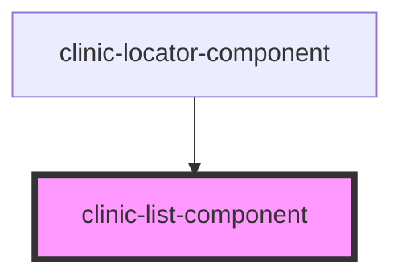

# clinic-list-component

<!-- Auto Generated Below -->

## Properties

| Property     | Attribute | Description | Type     | Default     |
| ------------ | --------- | ----------- | -------- | ----------- |
| `clinicList` | --        |             | `any[]`  | `undefined` |
| `search`     | `search`  |             | `string` | `undefined` |

## Dependencies

### Used by

 - [clinic-locator-component](../clinic-locator-component)

### Graph

----------------------------------------------

*Built with [StencilJS](https://stenciljs.com/)*
