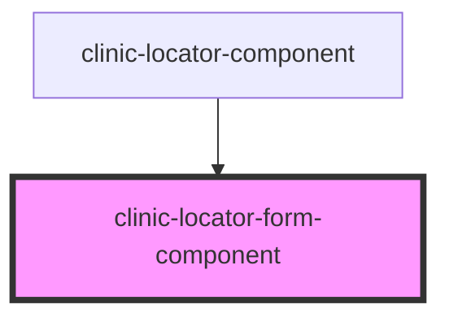

# clinic-locator-form-component

<!-- Auto Generated Below -->

## Properties

| Property | Attribute | Description | Type     | Default     |
| -------- | --------- | ----------- | -------- | ----------- |
| `label`  | `label`   |             | `string` | `undefined` |
| `type`   | `type`    |             | `string` | `'text'`    |

## Events

| Event          | Description | Type                  |
| -------------- | ----------- | --------------------- |
| `valueChanged` |             | `CustomEvent<string>` |

## Dependencies

### Used by

 - [clinic-locator-component](../clinic-locator-component)

### Graph

----------------------------------------------

*Built with [StencilJS](https://stenciljs.com/)*
